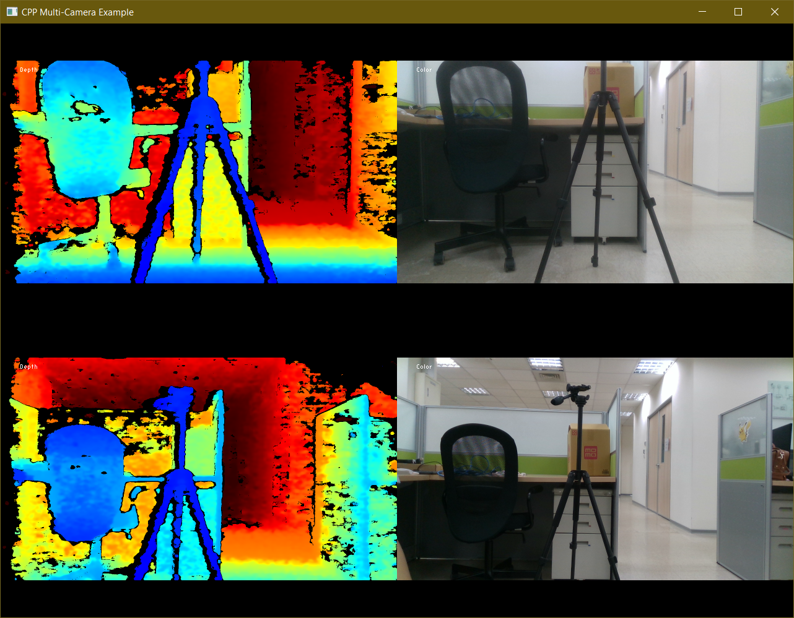

# LIPSedge™ AE400 Industrial 3D Camera

**LIPSedge™ AE400** is an industrial GigE 3D camera with IP67 protection and powered by Intel® RealSense™ technology and designed for industrial applications, such as robot application, logistic/factory automation, and 3D monitoring/inspection.

 - [Product Overview](https://www.lips-hci.com/product-page/lipsedge-ae400-industrial-3d-camera)
 - [Product Datasheet](https://filebox.lips-hci.com/index.php/s/ZNO5JggmYeddYcA?path=%2FDatasheet#pdfviewer)
 - [Latest LIPS SDK & FW Upgrade](https://www.lips-hci.com/lipssdk)

 | Title | Video |
 | ----- | --- |
 | AE400 360° Product View and Introduction | [](https://www.youtube.com/watch?v=kyjbJSM6CjQ "LIPSedge™ AE400 Industrial 3D Camera") |
 | AE400 Point Cloud DEMO (use realsense-viewer) | [](http://www.youtube.com/watch?v=oSCOOGzJRbo "LIPSedge™ AE400 Point Cloud") |

## SDK Overview
This software development kits(SDK) is fully compatible to [Intel® RealSense™ SDK 2.0](https://github.com/IntelRealSense/librealsense) to assist you connect LIPSedge AE400 3D camera to your application fast and easily. RealSense™ SDK 2.0 already offers many tools, code samples, and wrappers for integration with existing 3rd-party technologies and software languages.

### Branch/Version Information

| Branch    | LIPS SDK ver. | AE400 FW ver. | Min. RS SDK ver.| Support status  |
| --------- | ------------- | ------------- | --------------- | --------------- |
| master    | v1.0.2.0 :new:| recommend v2.5| v2.43.0         | v2.43 ~ v.2.48  |
| master    | v1.0.0.5      |               | v2.38.1         | v2.38 ~ present |
| master    | v1.0.0.2      | v2.1          | v2.32.0         | v2.32 ~ present |
| sdk-v0907 | v0.9.0.7      | v1.4          | v2.17.1         | v2.17 ~ v2.21 ([learn more](doc/support_list_ae400_realsense_sdk.md)) |

Known issues:
 - realsense-viewer may not work or no responding when running v1.0.2.0 with RS v2.49~2.50

Download latest LIPS SDK and FW from https://www.lips-hci.com/lipssdk

LIPS SDK v1.0.2.0
* Upgrade RS codebase to 2.43.0

LIPS SDK v1.0.0.2

* Since this version, SDK supports multicam, that means you can connect 2 or more AE400 cameras. However, more AE400 camera means more CPU computing ability and network adapters/bandwidth required on your host. Your Gigabit PoE switch also have to provide sufficient power to all the connected cameras.
 - [Release Note](https://filebox.lips-hci.com/index.php/s/twUlwqdzNFl7RAc?path=%2FUser%20Guide)
 - [FW Update Guide](https://filebox.lips-hci.com/index.php/s/twUlwqdzNFl7RAc?path=%2FUser%20Guide) (see Ch.8.5 for Firmware Update)

NOTE: branch ks2.v43.0 is for camera KS2 ([learn more](doc/build_ks2.md))

## Build instruction
You need CMake to build this SDK, please refer steps described on RealSense™ SDK document.
 - [Installation on Ubuntu Linux](https://github.com/IntelRealSense/librealsense/blob/master/doc/installation.md)
 - [Installation on Windows](https://github.com/IntelRealSense/librealsense/blob/master/doc/installation_windows.md)

The simple command to have Release build is
 ```
 $ mkdir build_Release
 $ cd build_Release
 $ cmake .. -DCMAKE_BUILD_TYPE=Release
 $ make -j4
 $ sudo make install
 ```

### Patch your RealSense™ SDK to support AE400
LIPS provides a helper shell script to upgrade a clean RealSense SDK release automatically to support LIPSedge AE400 3D camera.

Patch your local RealSense SDK git repository with our helper script, assume you are using latest release [v2.38.1](https://github.com/IntelRealSense/librealsense/releases/tag/v2.38.1). First, you have to clone a clean codebase from
libealsense.git and switch it to release v2.38.1.
```
$ git clone https://github.com/IntelRealSense/librealsense.git /home/<username>/rs2
$ cd ~/rs2
$ git checkout -b rs2.38.1 v2.38.1

```

Next step you have to clone [AE400 SDK](https://github.com/lips-hci/ae400-realsense-sdk) to your host, switch to it and run the script, you have to input path of your RealSense source directory as input argument.
```
$ cd /home/<username>/
$ git clone https://github.com/lips-hci/ae400-realsense-sdk.git
$ cd ae400-realsense-sdk
$ ./scripts/patch-realsense-to-lips-ae400-sdk.sh ~/rs2
```
Done! You are successfully patching your codebase. Now you can build AE400 SDK from the source.

:bulb: For Windows users, we recommend [Git for Windows](https://gitforwindows.org/) which provides a BASH emulation used to run Git from the command line, you can run our script inside Git BASH environment.


## Build wrappers for your applications
Intel RealSense SDK already supports many 3rd-party technologies, you can check the [build configurations](https://github.com/IntelRealSense/librealsense/wiki/Build-Configuration) to enable the wrapper you want and re-run CMake build to get binary library.

 - wrapper overview ([learn more](https://github.com/IntelRealSense/librealsense/tree/master/wrappers))

### wrappers provided by Intel RealSense™ SDK
 - OpenCV ([learn more](https://github.com/IntelRealSense/librealsense/tree/master/wrappers/opencv))
 - OpenNI2 ([learn more](https://github.com/IntelRealSense/librealsense/tree/master/wrappers/openni2))
 - Python 2.7 / 3.6 / 3.7 ([learn more](https://github.com/IntelRealSense/librealsense/tree/master/wrappers/python))
 - ROS ([learn more](https://github.com/IntelRealSense/realsense-ros))

### wrappers provided by LIPS
 - [NVIDIA Isaac SDK](https://developer.nvidia.com/isaac-sdk) integration how-to ([learn more](https://github.com/lips-hci/stereo_ae400))
 - :mega: LIPS has joined NVIDIA ISAAC eco-system and AE400 just passed HW/SW sensor-certification since release 2020.1.

The simple command to build Release SDK with OpenNI2/OpenCV/Python wrappers is (assume python 3)
```
$ export OpenCV_DIR=/usr/local/share/OpenCV
$ cmake .. \
  -DCMAKE_BUILD_TYPE=Release \
  -DBUILD_OPENNI2_BINDINGS=true \
  -DOPENNI2_DIR=/usr/include/openni2 \
  -DBUILD_PYTHON_BINDINGS=true \
  -DPYTHON_EXECUTABLE=/usr/bin/python3 \
  -DBUILD_CV_EXAMPLES=true
$ make -j4
$ sudo make install
```

## Installation on Ubuntu Linux
Run CMake in the patched git repository, assume output directory is 'build_Release'
* Open your preferred text editor, e.g. vim, to edit network setting
```
rs2$ cd build_Release
rs2/build_Release$ vim config/network.json
```
Default IP address is 192.168.0.100. You have to modify it according to your network environment.

:wrench: Latest [LIPS SDK v1.0.0.2](https://www.lips-hci.com/lipssdk) supports multicam, you could specify different IP addresses for 2 or more AE400 cameras, just input how many cameras you are going to connect with in the setting property 'count' and assign IP address for each camera. (ip1, ip2, ip3,... and so on)

* Network config for LIPS SDK v1.0.0.2 (multicam)
```
{
    "count": "2",
    "config": {
        "ip1": "192.168.0.100",
        "ip2": "192.168.1.100"
    }
}
```

* Network config for LIPS SDK v0.9.0.7 (single cam)
```
{
    "config": {
        "ip": "192.168.0.100"
    }
}
```

* After saving file network.json, you can run install command, default install prefix is '/usr/local'.
```
rs2/build_Release$ sudo make install
```

#### Run multicam example
```
rs2/build_Release$ cd examples/mulitcam
rs2/build_Release/examples/multicam$ ./rs-multicam
network setting is found at /usr/etc/LIPS/lib/network.json

```


#### Run capture example
```
rs2/build_Release$ cd examples/capture
rs2/build_Release/examples/capture$ ./rs-capture
network setting is found at /usr/etc/LIPS/lib/network.json

```


## Installation on Windows
Assume you have processed the script to patch your RealSense™ SDK repository and completed CMake configuration and generation to generate the Visual Studio 2015/2017 project solution. Open librealsense2.sln, find project 'install_network_config' and edit the source 'network.json'


Re-build the solution 'librealsense2', the updated network.json is copied to your runtime output directory, e.g. 'Release' or 'Debug' together with your binary executables, e.g. realsense-viewer.exe or rs-capture.exe.

#### Run capture example
Double click the example 'rs-capture.exe' to run it! Make sure you have correct IP address setting in network.json in the same directory.

## Trouble Shooting (network connection)
:bulb: you can use command 'ping' to check network connection between your PC host and AE400 camera, this is useful debug technique to check host-to-AE400 connection.
```
C:\>ping <your AE400 IP address>
```
For example, assume your AE400 camera IP address is 192.168.0.100
```
C:\>ping 192.168.0.100

Pinging 192.168.0.100 with 32 bytes of data:
Reply from 192.168.0.100: bytes=32 time<1ms TTL=64
Reply from 192.168.0.100: bytes=32 time<1ms TTL=64
Reply from 192.168.0.100: bytes=32 time<1ms TTL=64
Reply from 192.168.0.100: bytes=32 time<1ms TTL=64

Ping statistics for 192.168.0.100:
   Packets: Sent = 4, Received = 4, Lost = 0 (0% loss),
...
```

**NOTE**: You might get build errors or meet problems to run realsense-viewer on Windows/Linux. Any questions are welcome, please file issues on Github or send your problems to [LIPS]((https://www.lips-hci.com/contact)).
:email: info@lips-hci.com
